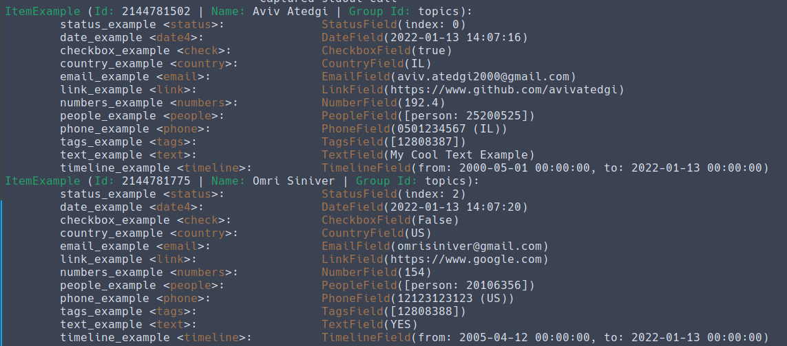

# [Monday Item Parser](https://github.com/avivatedgi/monday-item-parser)

[](https://github.com/avivatedgi/monday-item-parser/actions/workflows/tests.yml) [](https://badge.fury.io/py/monday-item-parser)

## Introduction

[Monday Item Parser](https://github.com/avivatedgi/monday-item-parser) is a library used to define [Monday](www.monday.com) items structure in a specific board, and lets the user fetch, create, update and delete items from this board.

## Installation

```bash
pip install monday-item-parser
```

## Requirements

* Python >= 3.7
* [Monday library](https://github.com/ProdPerfect/monday) for the Mondayhttp client

## Changelog

* 0.1.0 - First release

## How to use

### Items

Items are the full board item structure, built from fields.

```python
from monday import MondayClient
from monday_item_parser import Item, CheckboxField


board_id = 1234
monday_client = MondayClient("MONDAY_API_KEY_HERE")


class MyItem(Item, board_id=board_id, monday_client=monday_client):
    checkbox_example = CheckboxField()

    # Can be declared either as a type or as an instance, so this is good as well:
    checkbox_example = CheckboxField
```

**NOTE:** The variables in your item class must be named EXACTLY the same as in your monday board but in lower-case and replace spaces into underscore. For example a column in Monday with the name `My Nice Column` will must be defined in your item class `my_nice_column`.

#### Fetch items from board

```pycon
>>> for item in ExampleItem.fetch_items_from_board():
>>>     print(item)
```



#### Create Item

**NOTE:** You can only create an item that isn't fetched from the board / already created using this exact function. If you want to create a new item that was fetched from the board you should use the `duplicate_item` function

```pycon
>>> item = MyItem(checkbox_example=True)
>>> item.name = "My First Example"
>>> item.create_item()
```

#### Duplicate Item

**NOTE:** You can only duplicate an item that was fetched from the board / created by the `create_item` function.

```pycon
>>> new_item = item.duplicate_item()
```

#### Update Item

**NOTE:** You can only update an item that was fetched from the board / created by the `create_item` function.

```pycon
>>> new_item.name = 'Updated Item'
>>> new_item.checkbox_example.value = False
>>> new_item.update_item()
```

#### Delete Item

**NOTE:** You can only delete an item that was fetched from the board / created by the `create_item` function.

```pycon
>>> new_item.delete_item()
```

#### Get Group Ids in Board

```pycon
>>> for group_id in ItemExample.fetch_group_ids():
>>>     print(group_id)
"topics"
"group_title"
```

### Fields

Field is actually an Monday board's item column. The currently supported types are:


| Monday Column Type | Library Class Name |
| ------------------ | ------------------ | 
| Checkbox | `CheckboxField` |
| Country | `CountryField` |
| Date | `DateField` |
| Email | `EmailField` |
| Link | `LinkField` |
| Number | `NumberField` |
| People | `PeopleField` |
| Phone | `PhoneField` |
| Status | `StatusField` |
| Tags | `TagsField` |
| Text | `TextField` |
| Timeline | `TimelineField` |


## Special Thanks

* [Hydration](https://github.com/shustinm/hydration) ([Michael Shustin](https://github.com/shustinm/)) For the idea of the items metaclass
* [Monday](https://github.com/ProdPerfect/monday) ([ProdPerfect](https://github.com/ProdPerfect)) For the Monday client use in the library